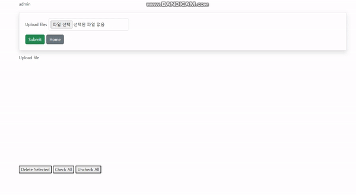

## 프로젝트 소개

이 프로젝트는 Django를 기반으로 한 웹 기반 데이터 라벨링 툴을 개발하는 것을 목표로 합니다. 이 도구는 데이터 과학자, 머신 러닝 엔지니어, 연구원 및 학생들이 데이터를 효율적으로 분류하고 라벨링할 수 있게 돕기 위해 설계되었습니다. 사용자는 이미지, 텍스트, 오디오, 비디오 등 다양한 유형의 데이터에 대해 정확한 라벨을 부착할 수 있습니다.
현제 많은 산업에서 데이터 과학과 머신 러닝의 역할이 점점 중요해지고 있습니다. 이러한 기술들은 효율적이고 정확한 데이터 라벨링에 크게 의존하고 있으며, 이 프로젝트는 이러한 요구를 충족하기 위해 시작되었습니다.

#### Django Labeller의 실제 작동 모습

- 
- 
- 

프로젝트 배포 : http://43.201.55.17/ 

## 프로젝트 개요

- 목적: 이미지/텍스트 데이터를 효율적으로 라벨링하여 데이터 분석 및 머신 러닝 모델 훈련을 용이하게 하는 도구 개발.

- 대상 사용자: 데이터 과학자, 머신 러닝 엔지니어, 연구원, 라벨링 작업자.

## 주요 기능

- 회원 가입 및 로그인 : 회원 별로 자신이 업로드한 이미지 및 라벨에만 접근하여 작업을 수행할 수 있음

- 데이터 업로드: 사용자가 이미지 또는 텍스트 파일을 시스템에 업로드할 수 있음.

- 라벨 생성 및 관리: 사용자가 새로운 라벨을 생성하고, 삭제할 수 있음.

- 데이터 라벨링: 업로드된 데이터에 라벨을 할당하고, 수정하며, 제거할 수 있음.

- 라벨 검토 및 수정: 라벨링된 데이터를 검토하고 필요에 따라 수정할 수 있음.

- 사용자 관리: 사용자 계정 생성, 권한 할당 및 관리 기능.


##  기술 스택
- 프론트엔드: HTML, CSS, JavaScript 

- 백엔드: Django, Django REST framework

- 데이터베이스: Sqlite

- 호스팅/배포: AWS EC2

## install 

``` 
> pip install Django
> pip install django-storages
> pip install django-bootstrap4
> pip install -r requirements.txt
```

## shell script
``` 
> cd mysite
> python manage.py runserver
```


## 📋 API 명세
| HTTP Method | End Point | Description |
| -- | -- | -- |
| POST | /signup/ | 회원가입 |
| POST | /login/ | 로그인 |
| POST | /logout/ | 로그아웃 |
| POST | /labeling_tool/image_upload/ | 이미지 업로드 | 
| POST | /labeling_tool/labelList_upload/ | 라벨 리스트 업로드 | 
| GET | /labeling_tool/download/all-descriptions/ | 라벨 정보 다운로드 | 
| GET | /description/ | 라벨링 툴 사용법 설명 | 
| POST | /labeling_tool/image_slider/ | 라벨링 작업 | 


